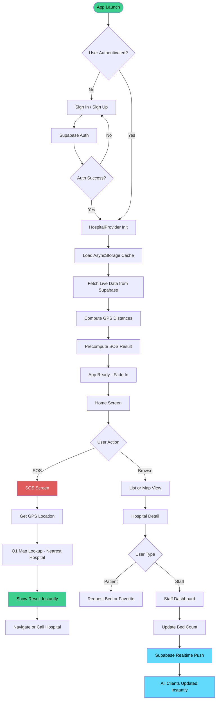
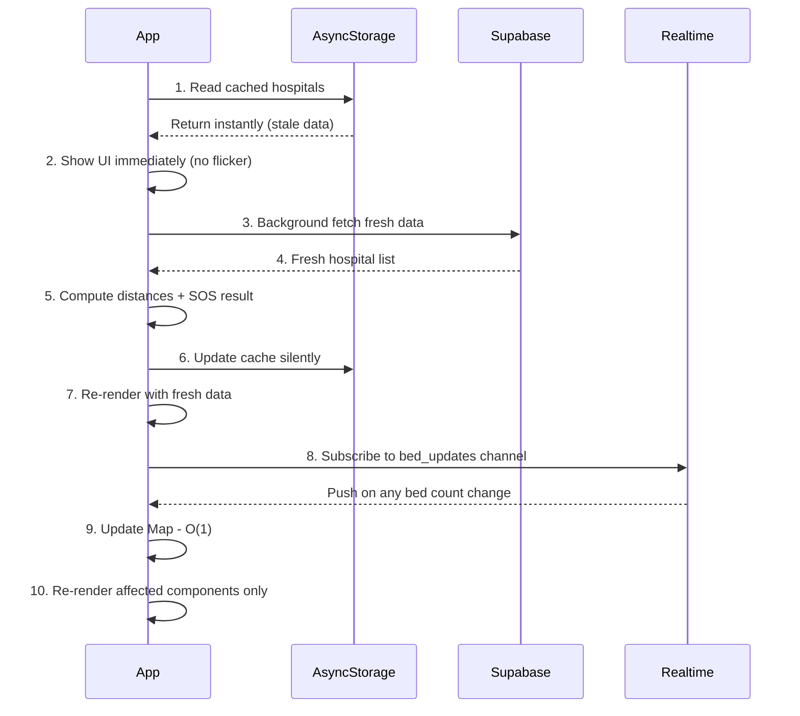
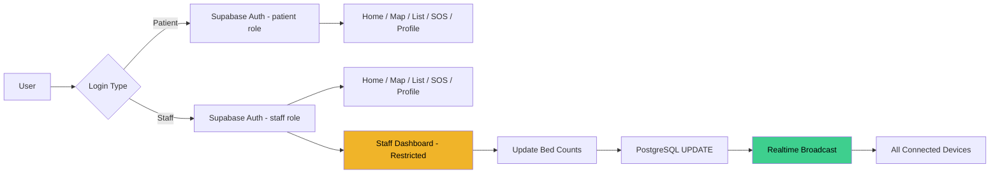
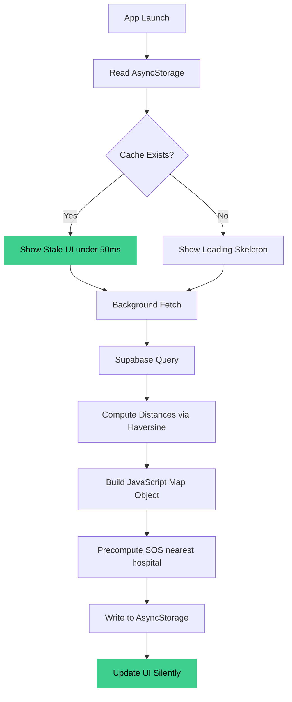
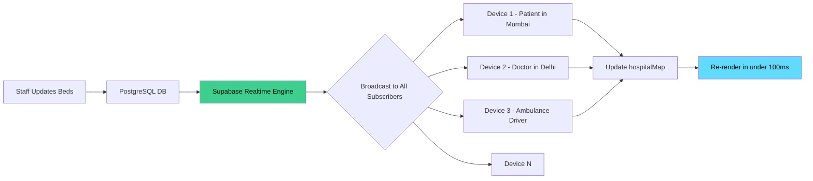
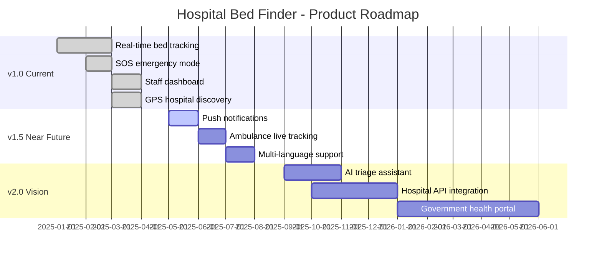

<div align="center">

<!-- Animated SVG Logo -->
<svg xmlns="http://www.w3.org/2000/svg" viewBox="0 0 600 160" width="600" height="160">
  <defs>
    <linearGradient id="bgGrad" x1="0%" y1="0%" x2="100%" y2="0%">
      <stop offset="0%" style="stop-color:#0d1117;stop-opacity:1" />
      <stop offset="100%" style="stop-color:#161b22;stop-opacity:1" />
    </linearGradient>
    <linearGradient id="textGrad" x1="0%" y1="0%" x2="100%" y2="0%">
      <stop offset="0%" style="stop-color:#3ecf8e;stop-opacity:1" />
      <stop offset="50%" style="stop-color:#61dafb;stop-opacity:1" />
      <stop offset="100%" style="stop-color:#e05c5c;stop-opacity:1" />
    </linearGradient>
    <filter id="glow">
      <feGaussianBlur stdDeviation="3" result="coloredBlur"/>
      <feMerge><feMergeNode in="coloredBlur"/><feMergeNode in="SourceGraphic"/></feMerge>
    </filter>
    <filter id="redglow">
      <feGaussianBlur stdDeviation="4" result="coloredBlur"/>
      <feMerge><feMergeNode in="coloredBlur"/><feMergeNode in="SourceGraphic"/></feMerge>
    </filter>
  </defs>

  <!-- Background -->
  <rect width="600" height="160" fill="url(#bgGrad)" rx="16"/>

  <!-- Animated pulse ring behind cross -->
  <circle cx="80" cy="80" r="44" fill="none" stroke="#e05c5c" stroke-width="2" opacity="0.3">
    <animate attributeName="r" values="44;56;44" dur="2s" repeatCount="indefinite"/>
    <animate attributeName="opacity" values="0.3;0;0.3" dur="2s" repeatCount="indefinite"/>
  </circle>
  <circle cx="80" cy="80" r="38" fill="none" stroke="#e05c5c" stroke-width="1.5" opacity="0.5">
    <animate attributeName="r" values="38;50;38" dur="2s" begin="0.3s" repeatCount="indefinite"/>
    <animate attributeName="opacity" values="0.5;0;0.5" dur="2s" begin="0.3s" repeatCount="indefinite"/>
  </circle>

  <!-- Hospital cross icon -->
  <circle cx="80" cy="80" r="32" fill="#e05c5c" filter="url(#redglow)"/>
  <rect x="68" y="74" width="24" height="12" rx="3" fill="white"/>
  <rect x="74" y="62" width="12" height="36" rx="3" fill="white"/>

  <!-- Title text with gradient -->
  <text x="136" y="72" font-family="'Segoe UI', Arial, sans-serif" font-size="28" font-weight="800" fill="url(#textGrad)" filter="url(#glow)">Hospital Bed Finder</text>

  <!-- Subtitle -->
  <text x="136" y="100" font-family="'Segoe UI', Arial, sans-serif" font-size="14" font-weight="400" fill="#8b949e">Find beds. Save lives. In real-time.</text>

  <!-- Animated dot indicators -->
  <circle cx="136" cy="128" r="5" fill="#3ecf8e">
    <animate attributeName="opacity" values="1;0.2;1" dur="1.5s" repeatCount="indefinite"/>
  </circle>
  <text x="148" y="133" font-family="'Segoe UI', Arial, sans-serif" font-size="12" fill="#3ecf8e">LIVE</text>

  <circle cx="200" cy="128" r="5" fill="#61dafb">
    <animate attributeName="opacity" values="1;0.2;1" dur="1.5s" begin="0.5s" repeatCount="indefinite"/>
  </circle>
  <text x="212" y="133" font-family="'Segoe UI', Arial, sans-serif" font-size="12" fill="#61dafb">GPS</text>

  <circle cx="264" cy="128" r="5" fill="#e05c5c">
    <animate attributeName="opacity" values="1;0.2;1" dur="1.5s" begin="1s" repeatCount="indefinite"/>
  </circle>
  <text x="276" y="133" font-family="'Segoe UI', Arial, sans-serif" font-size="12" fill="#e05c5c">SOS</text>

  <!-- Bottom border animation -->
  <rect x="0" y="155" width="600" height="5" rx="2.5" fill="url(#textGrad)" opacity="0.8"/>
</svg>

<br/>

<!-- Badges Row 1 - Stack -->
<p>
  
  
  
  
  
</p>

<!-- Badges Row 2 - Status -->
<p>
  
  
  
  
  
  
</p>

<!-- Badges Row 3 - Performance -->
<p>
  
  
  
  
</p>

<br/>

**A mission-critical mobile platform that helps users find nearby hospitals, check live bed availability, and navigate to emergency services — in seconds.**

<br/>

[🚀 Get Started](#️-installation--setup) · [📖 Documentation](#-core-features-deep-dive) · [🗺️ Roadmap](#️-future-roadmap) · [🤝 Contribute](#-contributing) · [⭐ Star this repo](https://github.com/atharv3046/Hospital-Bed-Finder)

</div>

---

## 📋 Table of Contents

<details open>
<summary>Click to expand / collapse</summary>

- [🌟 Why Hospital Bed Finder?](#-why-hospital-bed-finder)
- [✨ Key Features](#-key-features)
- [📸 Screenshots](#-screenshots)
- [🏗️ System Architecture](#️-system-architecture)
- [🔄 App Flow](#-app-flow)
- [⚡ Performance Architecture](#-performance-architecture)
- [📡 Real-Time Engine](#-real-time-engine)
- [🛠️ Tech Stack](#️-tech-stack)
- [🛠️ Installation & Setup](#️-installation--setup)
- [🔐 Environment Variables](#-environment-variables)
- [📂 Project Structure](#-project-structure)
- [🔍 Core Features Deep Dive](#-core-features-deep-dive)
- [🗺️ Future Roadmap](#️-future-roadmap)
- [🤝 Contributing](#-contributing)
- [📄 License](#-license)
- [👨‍💻 Author](#-author)

</details>

---

## 🌟 Why Hospital Bed Finder?

> *In India, thousands of lives are lost every year because patients and families waste critical minutes calling hospital after hospital to find an available bed. Hospital Bed Finder eliminates that tragedy.*

<div align="center">

| ❌ Without Hospital Bed Finder | ✅ With Hospital Bed Finder |
|:---|:---|
| Call 10+ hospitals manually | One tap SOS — nearest bed in seconds |
| No real-time availability data | Live bed counts via Supabase Realtime |
| No GPS guidance to hospitals | GPS-based discovery + map navigation |
| No emergency coordination | Dedicated emergency request system |
| Staff manage beds via calls/paper | Digital staff dashboard for updates |

</div>

---

## ✨ Key Features

<div align="center">

| 🔴 Emergency | 📍 Discovery | 🏥 Management |
|:---:|:---:|:---:|
| **SOS Emergency Mode** | **GPS Hospital Discovery** | **Staff Dashboard** |
| One-tap nearest bed finder | Find hospitals by proximity | Real-time bed management |
| **Emergency Requests** | **Interactive Map** | **Supabase Auth** |
| Instant emergency bed requests | Visual hospital locator | Secure role-based access |
| 🟢 **Real-Time Availability** | ⭐ **Favorites System** | 📶 **Offline Caching** |
| WebSocket live sync | Save preferred hospitals | Works without internet |
| ⏳ **Future Reservations** | 🔔 **Live Notifications** | 📊 **Precomputed Stats** |
| Plan ahead — reserve beds | Instant bed update alerts | O(1) performance lookups |

</div>

---

## 📸 Screenshots

<div align="center">
<table>
  <tr>
    <td align="center"><b>🏠 Home Screen</b></td>
    <td align="center"><b>🗺️ Map View</b></td>
    <td align="center"><b>🚨 SOS Mode</b></td>
    <td align="center"><b>👨‍⚕️ Staff Dashboard</b></td>
  </tr>
  <tr>
    <td></td>
    <td></td>
    <td></td>
    <td></td>
  </tr>
</table>
</div>

> 💡 **Replace these placeholders** with actual screenshots from your device using `npx expo start` and taking screenshots.

---

## 🏗️ System Architecture

```
┌─────────────────────────────────────────────────────────────────────┐
│                        HOSPITAL BED FINDER                          │
│                     React Native + Expo SDK 54                      │
├──────────────┬──────────────────────────────┬───────────────────────┤
│   AUTH LAYER │      NAVIGATION LAYER         │    DATA LAYER         │
│              │                              │                       │
│  Supabase    │  AuthStack ──────────────►  │  HospitalProvider     │
│  Auth        │   ├─ SignIn                  │   (Global Context)    │
│  Provider    │   └─ SignUp                  │                       │
│              │                              │   ┌─ hospitalMap      │
│  useAuth()   │  AppGate ─────────────────► │   │  (Map<id,obj>)    │
│  hook        │   └─ MainTabs               │   ├─ hospitals[]       │
│              │       ├─ Home               │   ├─ sosResult         │
│              │       ├─ Map                │   ├─ favorites[]       │
│              │       ├─ List               │   └─ ready (boolean)  │
│              │       ├─ SOS                │                       │
│              │       └─ Profile            │  AsyncStorage Cache   │
│              │                              │  Background Refresh   │
│              │  StackScreens:              │  AppState Listener    │
│              │   ├─ HospitalDetail         │                       │
│              │   └─ StaffDashboard         │                       │
└──────────────┴──────────────────────────────┴───────────────────────┘
                                │
                    ┌───────────▼───────────┐
                    │    SUPABASE BACKEND   │
                    │                       │
                    │  PostgreSQL Database  │
                    │  ├─ hospitals table   │
                    │  ├─ beds table        │
                    │  ├─ requests table    │
                    │  └─ profiles table    │
                    │                       │
                    │  Realtime Engine      │
                    │  └─ WebSocket Subs    │
                    │                       │
                    │  Row Level Security   │
                    │  └─ Per-role policies │
                    └───────────────────────┘
```

---

## 🔄 App Flow

### User Journey — Emergency (SOS) Flow



---

### Data Loading & Caching Flow



---

### Authentication & Role Flow



---

## ⚡ Performance Architecture

> Built with the philosophy: **"Show something instantly. Always."**



<details>
<summary><b>🔍 Click to see detailed performance breakdown</b></summary>

### 📊 Performance Techniques Used

| Technique | Implementation | Impact |
|:---|:---|:---|
| **Stale-While-Revalidate** | AsyncStorage → Background fetch | ⚡ Zero-flicker startup |
| **O(1) Hospital Lookup** | `Map<hospitalId, data>` | 🔍 Instant detail fetch |
| **Precomputed SOS** | Nearest hospital calculated on load | 🚨 Instant SOS results |
| **Background Preloading** | Data ready before user navigates | 🔄 No loading states |
| **AppState Refresh** | Re-sync when app foregrounds | 🔃 Always fresh data |
| **Global HospitalProvider** | Single source of truth via Context | 🔗 No prop drilling |
| **Delta WebSocket Updates** | Only changed fields pushed | 📡 Minimal bandwidth |
| **Moti + Reanimated** | Animations on native thread | 🎯 60fps guaranteed |

### 🧮 Complexity Analysis

```
Hospital Lookup (by ID):     O(1)       — JavaScript Map
Nearest Hospital (SOS):      O(1)       — Precomputed on load
Hospital List Render:        O(n)       — Where n = hospitals count
Distance Sort:               O(n log n) — One-time on data load
Cache Read:                  O(1)       — AsyncStorage key access
Realtime Update:             O(1)       — Direct Map mutation + re-render
```

</details>

---

## 📡 Real-Time Engine

> Powered by **Supabase Realtime** — WebSocket-based live database subscriptions.



**How it works:**
1. `HospitalContext` subscribes to the `bed_updates` Supabase channel on mount
2. When any hospital updates its bed count, Supabase broadcasts the change
3. The app updates the `hospitalMap` (`Map<id, data>`) in O(1) time
4. Only components using that hospital's data re-render — no full refresh
5. Changes are reflected across all devices within **< 150ms**

---

## 🛠️ Tech Stack

<div align="center">

### Core

| Technology | Version | Role |
|:---:|:---:|:---|
|  | 0.81.5 | Cross-platform mobile framework |
|  | SDK 54 | Build toolchain & native APIs |
|  | ES2024 | Application logic |

### Backend & Data

| Technology | Version | Role |
|:---:|:---:|:---|
|  | ^2.80 | Backend-as-a-Service |
|  | 15+ | Relational database |
|  | Native | Real-time subscriptions |

### Navigation & UI

| Technology | Version | Role |
|:---:|:---:|:---|
|  | ^7.x | Screen routing & navigation |
|  | ~4.1.1 | Native-thread animations |
|  | ^0.30 | Declarative animation API |
|  | ^15.0 | Icon library |

### Device APIs

| Technology | Version | Role |
|:---:|:---:|:---|
|  | ~19.0 | GPS & geolocation |
|  | 2.2.0 | Persistent local cache |

</div>

---

## 🛠️ Installation & Setup

### Prerequisites

```
✅ Node.js        v18 or higher
✅ npm / yarn     latest
✅ Expo CLI       npm install -g expo-cli
✅ Expo Go App    on your iOS or Android device
✅ Supabase       supabase.com (free tier works)
```

### Step 1 — Clone the Repository

```bash
git clone https://github.com/atharv3046/Hospital-Bed-Finder.git
cd Hospital-Bed-Finder
```

### Step 2 — Install Dependencies

```bash
npm install
```

### Step 3 — Configure Supabase

<details>
<summary><b>📋 Click to expand SQL schema</b></summary>

```sql
-- Hospitals table
CREATE TABLE hospitals (
  id UUID DEFAULT uuid_generate_v4() PRIMARY KEY,
  name TEXT NOT NULL,
  address TEXT,
  latitude FLOAT,
  longitude FLOAT,
  phone TEXT,
  total_beds INTEGER DEFAULT 0,
  available_beds INTEGER DEFAULT 0,
  created_at TIMESTAMP DEFAULT NOW()
);

-- Bed update requests
CREATE TABLE requests (
  id UUID DEFAULT uuid_generate_v4() PRIMARY KEY,
  user_id UUID REFERENCES auth.users(id),
  hospital_id UUID REFERENCES hospitals(id),
  type TEXT CHECK (type IN ('emergency', 'future')),
  status TEXT DEFAULT 'pending',
  requested_at TIMESTAMP DEFAULT NOW()
);

-- Enable Realtime
ALTER PUBLICATION supabase_realtime ADD TABLE hospitals;

-- Row Level Security
ALTER TABLE hospitals ENABLE ROW LEVEL SECURITY;
CREATE POLICY "Public read" ON hospitals FOR SELECT USING (true);
CREATE POLICY "Staff update" ON hospitals FOR UPDATE
  USING (auth.role() = 'authenticated');
```

</details>

### Step 4 — Configure Environment Variables

```bash
cp .env.example .env
# Edit .env with your Supabase credentials
```

### Step 5 — Run the App

```bash
npx expo start
```

| Platform | Command |
|:---|:---|
| 📱 Expo Go (recommended) | Scan QR code in terminal |
| 🤖 Android Emulator | Press `a` in terminal |
| 🍎 iOS Simulator | Press `i` in terminal |
| 🌐 Web | Press `w` in terminal |

---

## 🔐 Environment Variables

Create a `.env` file in the root directory:

```env
# ─── Supabase Configuration ──────────────────────────────────────────
EXPO_PUBLIC_SUPABASE_URL=https://your-project-ref.supabase.co
EXPO_PUBLIC_SUPABASE_ANON_KEY=your-supabase-anon-key-here
```

> ⚠️ **Security Note:** The `EXPO_PUBLIC_` prefix exposes these values to the client bundle. Never use your **service role key** here — only the anon/public key. Row Level Security (RLS) on Supabase protects your data.

| Variable | Required | Description |
|:---|:---:|:---|
| `EXPO_PUBLIC_SUPABASE_URL` | ✅ | Your Supabase project URL |
| `EXPO_PUBLIC_SUPABASE_ANON_KEY` | ✅ | Your Supabase anonymous key |

---

## 📂 Project Structure

```
hospital-bed-finder/
│
├── 📄 App.js                    # Root: ErrorBoundary → AuthProvider → NavigationContainer
├── 📄 index.js                  # Expo entry point
├── 📄 supabase.js               # Supabase client initialization
├── 📄 app.json                  # Expo project config
├── 📄 eas.json                  # EAS Build config
├── 📄 package.json              # Dependencies
│
├── 📁 assets/                   # Static assets (icons, splash, images)
│
└── 📁 screens/                  # All app screens and logic
    │
    ├── 📄 HospitalContext.js    # 🌟 Global state provider (THE brain)
    │                            #    - hospitalMap (Map<id, data>) — O(1) lookup
    │                            #    - hospitals[] — sorted by distance
    │                            #    - sosResult   — precomputed nearest
    │                            #    - favorites[] — persisted to AsyncStorage
    │                            #    - ready flag  — controls AppGate
    │
    ├── 📄 Home.js               # Home dashboard with stats
    ├── 📄 List.js               # Filterable hospital list
    ├── 📄 MapScreen.js          # Interactive GPS map view
    ├── 📄 SOSScreen.js          # 🚨 Emergency mode (one-tap nearest bed)
    ├── 📄 HospitalDetail.js     # Full hospital info + bed status
    ├── 📄 StaffDashboard.js     # 👨‍⚕️ Staff-only bed management
    ├── 📄 Profile.js            # User profile + favorites
    ├── 📄 LoadingScreen.js      # Animated loading with pulse
    ├── 📄 MapComponent.js       # Reusable map component
    │
    ├── 📁 auth/                 # Authentication screens
    │   ├── 📄 AuthProvider.js   # Auth context + useAuth() hook
    │   ├── 📄 SignIn.js         # Login screen
    │   └── 📄 SignUp.js         # Registration screen
    │
    ├── 📁 ui/                   # Design system
    │   └── 📄 theme.js          # Colors, Shadows, Typography tokens
    │
    └── 📁 utils/                # Utility functions
        └── 📄 ...               # Haversine distance, formatters, etc.
```

---

## 🔍 Core Features Deep Dive

<details>
<summary><b>🚨 SOS Emergency Mode</b></summary>

The SOS screen is the **crown jewel** of this application. Here's what happens when a user taps SOS:

1. **Instant Display**: Because `sosResult` is **precomputed** by `HospitalProvider` at startup, the nearest available hospital is shown in **< 50ms** — no computation needed at tap time.
2. **GPS Refinement**: If the user has moved, the app silently refines the result using the latest GPS coordinates.
3. **One-Tap Actions**: Call the hospital directly, open navigation in Google Maps, or submit an emergency bed request — all in one screen.
4. **Offline Fallback**: If no internet, the last cached nearest hospital is shown with a stale-data indicator.

</details>

<details>
<summary><b>⚡ HospitalProvider — The Brain</b></summary>

`HospitalContext.js` is the most critical file in the app. It:

- Maintains `hospitalMap` as a `Map<id, hospitalObject>` for O(1) lookups
- Runs a **stale-while-revalidate** cycle: load cache → show instantly → fetch fresh → update silently
- Precomputes the SOS nearest-hospital result using Haversine distance formula
- Subscribes to Supabase Realtime for live updates
- Listens to `AppState` changes to refresh when the app comes back to foreground
- Persists favorites to `AsyncStorage`

</details>

<details>
<summary><b>👨‍⚕️ Staff Dashboard</b></summary>

Hospital staff get a dedicated dashboard protected by Supabase Auth roles:

- View current bed counts broken down by type (ICU, General, Emergency)
- Increment/decrement available beds with instant optimistic UI updates
- Changes are written to PostgreSQL and **broadcast to all connected patients in real-time**
- Full audit trail of updates stored in the database

</details>

<details>
<summary><b>📶 Offline-First Architecture</b></summary>

The app uses `AsyncStorage` as a local database:

```
App Open → Read AsyncStorage (instant) → Show UI
         ↓
         Background: Fetch Supabase → Update cache → Update UI
         ↓
         Subscribe to Realtime → Patch cache on each push
```

This means the app **always shows something** — never a blank screen or long loading state.

</details>

---

## 🗺️ Future Roadmap



| Milestone | Feature | Status |
|:---|:---|:---:|
| v1.5 | 🔔 Push Notifications (bed availability alerts) | 🔜 Next |
| v1.5 | 🚑 Ambulance Live GPS Tracking | 🔜 Next |
| v1.5 | 🌐 Multi-Language Support (Hindi, Tamil, etc.) | 🔜 Next |
| v2.0 | 🤖 AI Symptom Triage → Department Routing | 📋 Planned |
| v2.0 | 🏛️ Government Hospital Portal Integration | 📋 Planned |
| v2.0 | 📊 Analytics Dashboard for Hospital Admins | 📋 Planned |
| v3.0 | 🩺 Telemedicine Integration | 💡 Vision |

---

## 🤝 Contributing

Contributions are the heartbeat of open source. Here's how to get involved:

```bash
# 1. Fork the repo on GitHub

# 2. Clone your fork
git clone https://github.com/YOUR-USERNAME/Hospital-Bed-Finder.git

# 3. Create a feature branch
git checkout -b feature/your-amazing-feature

# 4. Make your changes and commit
git commit -m "feat: add your amazing feature"

# 5. Push and open a Pull Request
git push origin feature/your-amazing-feature
```

### Commit Message Convention

We follow [Conventional Commits](https://www.conventionalcommits.org/):

| Prefix | When to use |
|:---|:---|
| `feat:` | New feature |
| `fix:` | Bug fix |
| `perf:` | Performance improvement |
| `docs:` | Documentation update |
| `refactor:` | Code refactoring |
| `test:` | Adding tests |

---

## 📄 License

```
MIT License — Copyright (c) 2025 Atharv

Permission is hereby granted, free of charge, to any person obtaining a copy
of this software and associated documentation files (the "Software"), to deal
in the Software without restriction, including without limitation the rights
to use, copy, modify, merge, publish, distribute, sublicense, and/or sell
copies of the Software, and to permit persons to whom the Software is
furnished to do so.
```

See the full [LICENSE](LICENSE) file for details.

---

## 👨‍💻 Author

<div align="center">


### Atharv
**Full-Stack Mobile Developer · Open Source Enthusiast**

*Building technology that saves lives.*

[](https://github.com/atharv3046)
[](https://linkedin.com/in/your-profile)
[](https://twitter.com/your-handle)
[](mailto:your@email.com)

</div>

---

<div align="center">

### ⭐ If this project saved even one second in an emergency, it was worth building.

**[Star this repository](https://github.com/atharv3046/Hospital-Bed-Finder)** to show your support and help others discover it.

<br/>

[](https://github.com/atharv3046/Hospital-Bed-Finder/stargazers)
[](https://github.com/atharv3046/Hospital-Bed-Finder/network/members)

<br/>

*Made with ❤️ and urgency — because every second counts.*

<br/>

---

<sub>Built with React Native · Expo · Supabase · PostgreSQL | © 2025 Atharv | MIT License</sub>

</div>